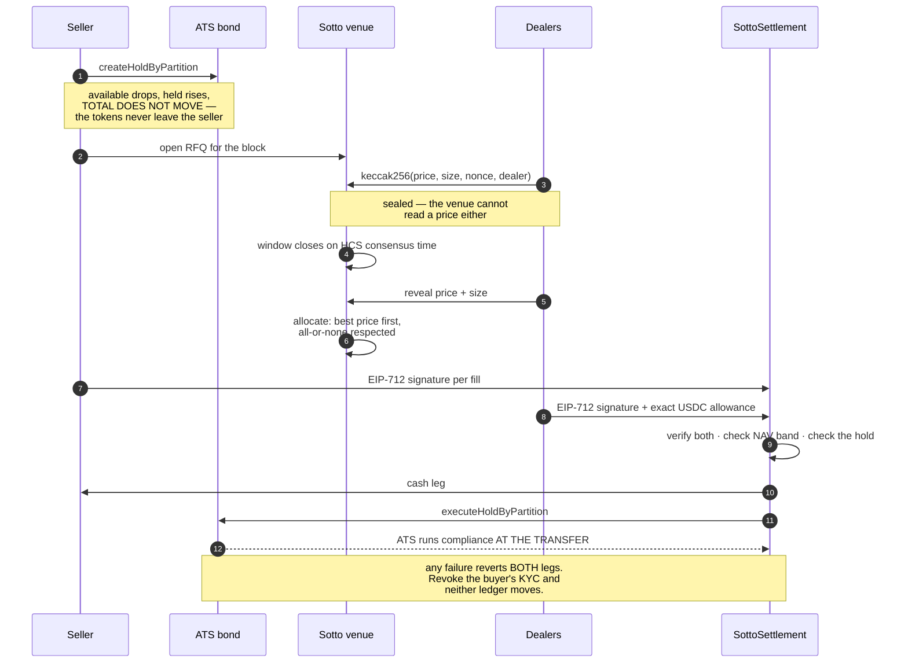

# Sotto

**A request-for-quote block-trading venue for ATS-issued securities, on Hedera.**

Asset Tokenization Studio lets an issuer mint a compliant bond. It does not let anyone
*trade* one. Sotto is the missing secondary market: a holder puts size up for bid, dealers
compete under commit–reveal so nobody can last-look off a rival's price, and the winning
trade settles as a single atomic delivery-versus-payment transaction — security leg and cash
leg, both or neither.

Compliance is not bolted on by the venue. It is enforced by the token itself, at the moment
of transfer. Revoke a buyer's KYC and the settlement reverts on-chain, with both ledgers
untouched.

> ATS ships a `Hold` primitive whose own documentation lists **"Secondary Market Trading"** as
> use case one: *"When placing a sell order, the marketplace needs ability to transfer your
> tokens to a buyer."* They built the escrow for a marketplace. The marketplace does not
> exist. Sotto is that marketplace.

**ETHOnline 2026 · Hedera · Tokenization of Anything**

| | |
|---|---|
| **Live venue** | _deploying — see [Running it](#running-it) to run it locally in two commands_ |
| **Demo video** | _recording_ |
| **Contracts** | five, all [verified on HashScan](#live-on-hedera-testnet) as `exact_match` |
| **Audit trail** | [HCS topic `0.0.10383803`](https://hashscan.io/testnet/topic/0.0.10383803) — public, consensus-ordered |
| **Cash** | real Circle USDC `0.0.429274`. Nothing was minted for convenience |

> **Judging or running the demo?** Start with the
> [three-minute walkthrough and operator guide](docs/DEMO-GUIDE.md). It separates what is
> browser-live, what is a deliberately labelled demo, and what is proven on-chain by scripts.

---

## One trade, end to end



Every arrow above is a real transaction on Hedera testnet. The hashes are in
[Proven on-chain](#proven-on-chain-not-asserted).

---

## Contents

- [One trade, end to end](#one-trade-end-to-end)
- [The venue](#the-venue)
- [Live on Hedera testnet](#live-on-hedera-testnet)
- [Judge walkthrough](#judge-walkthrough)
- [Verify it yourself](#verify-it-yourself)
- [How settlement works](#how-settlement-works)
- [Two settlement paths](#two-settlement-paths)
- [What makes this a venue and not a swap](#what-makes-this-a-venue-and-not-a-swap)
- [The bond lifecycle, all of it on-chain](#the-bond-lifecycle-all-of-it-on-chain)
- [Partial fills](#partial-fills)
- [The price source is real now](#the-price-source-is-real-now)
- [Known limitations](#known-limitations)
- [What we learned about ATS that is not in the docs](#what-we-learned-about-ats-that-is-not-in-the-docs)
- [Architecture](#architecture)
- [Running it](#running-it)
- [Roadmap: CLPR](#roadmap-clpr)

---

## Judge walkthrough

The Hedera prize asks for a real asset, compliance and lifecycle management—not merely a token
with a name. Sotto maps directly onto that rubric:

| Prize signal | Sotto proof |
|---|---|
| ATS-issued real asset | Bond, equity and short-dated note from factory `0.0.7708432` |
| Secondary market ATS does not provide | Sealed RFQ, price-time allocation, partial fills and firm quotes |
| Compliance in use | KYC is enforced inside ATS at delivery; revocation reverts both legs |
| Lifecycle operation | Issuance, trading, scheduled execution and redemption at maturity |
| Oracle/NAV integration | On-chain band guard with administrator NAV or live Chainlink source |
| Hedera-native services | HCS ordering, HTS cash, HIP-551 batch and HIP-1215 scheduled calls |
| Verifiability | HashScan transactions, public HCS sequence numbers and exact-match source |

For a no-key review, open the landing page, Rulebook, a labelled demo desk, Audit trail, and one
of the transactions below. For an owner-operated transaction, follow
[`docs/DEMO-GUIDE.md`](docs/DEMO-GUIDE.md).

**Wallet routes are explicit.** Path A is the complete EVM browser flow. Path B uses the official
Hedera WalletConnect adapter for a native `hedera:testnet` connection preview, while the complete
HIP-551 settlement remains chain-proven through `backend/src/scripts/settle-batch.ts`. The UI says
so plainly; a wallet connection is never presented as a transaction signature.

---

## The venue

Eight routes. Dark, dense, instrument-panel — tabular numerals so figures do not jitter when
they update, truncated monospace addresses with click-to-copy, no gradient hero. It should
look like something a trading desk would tolerate.

| Route | What it is for |
|---|---|
| `/` | The venue, and one sealed-quote demo you can play with before connecting anything |
| `/rulebook` | Commit–reveal, holds, compliance at transfer, and the two settlement paths |
| `/enter` | Choose a role, connect a wallet, or open a **clearly labelled** demo desk |
| `/issuer` | KYC grant and revoke · issue units · publish the reference NAV · redeem at maturity |
| `/seller` | Open an RFQ, escrow the block, watch the book, allocate it |
| `/dealer` | Seal a quote with a size, reveal it, approve the exact cash, settle |
| `/rfq/[id]` | The dual ledger — both sides of one trade, moving in the same instant |
| `/audit` | The HCS trail, with every commit's sequence number below every reveal's |

Two screens carry the whole thing.

**The position card.** Total, available, held, locked. Place a hold and *available drops while
held rises and **total does not move***. That one animation is the difference between this and
an escrow swap: the seller never stops being the holder of record, keeps earning coupons on
the full position, and stays subject to the issuer's freeze and seizure powers.

**The dual ledger.** Seller and buyer side by side, both updating in the same instant on
settlement. The simultaneity *is* the product.

### The whole demo runs in a browser

No terminal, at any point:

```
grant KYC → issue units → publish the reference NAV → open an RFQ → escrow the block
→ dealers seal quotes → window closes on consensus time → dealers reveal with a size
→ allocate across dealers → approve exact USDC → settle
→ revoke KYC and watch the next settlement revert with both ledgers untouched
→ redeem the matured note: principal paid, units burned
```

Placing the hold, signing each fill and approving the cash are **wallet transactions** — the
seller and the dealer sign with their own keys. The venue relays the final `settle()` and pays
its gas, which it can do because `settle()` is permissionless and both signatures bind the
exact trade. It cannot redirect or take anything; there is a test asserting precisely that.

What still needs a terminal is stated rather than hidden: the HIP-551 batch path, and
deploying a brand-new instrument. Neither is dressed up as a browser feature, in the UI or
here.

---

## Live on Hedera testnet

Two asset classes, both issued from Hedera's own deployed ATS factory `0.0.7708432`.
Cash is **real Circle USDC**. Nothing was minted for convenience.

| | |
|---|---|
| Bond — `STO-BOND-A` | [`0xD53072649037FEecD305920087791a37dF8D517F`](https://hashscan.io/testnet/contract/0xD53072649037FEecD305920087791a37dF8D517F) |
| Equity — `STO-EQ-A` | [`0x21C3E7368a77756E896D58a6f97C3099Cc9C47e0`](https://hashscan.io/testnet/contract/0x21C3E7368a77756E896D58a6f97C3099Cc9C47e0) |
| Short note — `STO-BOND-M` (matures in minutes, for the redemption demo) | [`0x9c4e704b27dda83566d6f9ce0A2b1418b2249f14`](https://hashscan.io/testnet/contract/0x9c4e704b27dda83566d6f9ce0A2b1418b2249f14) |
| `SottoSettlement` | [`0x73195C1f91899Bc1E822bb1D039033Eb38926931`](https://hashscan.io/testnet/contract/0x73195C1f91899Bc1E822bb1D039033Eb38926931) |
| `SottoNavOracle` | [`0xe8E7c39ba776C3B0778BE4571e72F5669f662c04`](https://hashscan.io/testnet/contract/0xe8E7c39ba776C3B0778BE4571e72F5669f662c04) |
| `SottoDealerBond` | [`0xea7545EC3C5E74e0A44f8c289a657b6D849227E5`](https://hashscan.io/testnet/contract/0xea7545EC3C5E74e0A44f8c289a657b6D849227E5) |
| `ChainlinkPriceSource` | [`0xFb321627eC70D7E86D82F80553dC2eC98BEb124a`](https://hashscan.io/testnet/contract/0xFb321627eC70D7E86D82F80553dC2eC98BEb124a) |
| `SottoCouponScheduler` | [`0xe23f19786E146fADdBd6b3EEa9994e9feC0cf847`](https://hashscan.io/testnet/contract/0xe23f19786E146fADdBd6b3EEa9994e9feC0cf847) |
| HCS audit topic | [`0.0.10383803`](https://hashscan.io/testnet/topic/0.0.10383803) |
| Cash | Circle USDC `0.0.429274` · EVM `0x…068cDa` · 6 dp |

**All five Sotto contracts are verified on Sourcify as `exact_match`**, which HashScan reads
automatically. The source you are reading is the bytecode that ran.

### Proven on-chain, not asserted

| What | Transaction |
|---|---|
| Atomic DvP — 20 bonds ↔ 19.67 USDC, both legs, one transaction | [`0x4c90cf5b…52fd`](https://hashscan.io/testnet/transaction/0x4c90cf5b62ed65ebdabb7621bb76c80596cd78dc29cf2303c68b3ccbcab552fd) |
| **Security for security** — 10 bonds ↔ 12 shares, no stablecoin in the trade | [`0x320fdef2…a1fb`](https://hashscan.io/testnet/transaction/0x320fdef2aacea95585bfaa7479a0e1fccc0e291ac03094218edb7cea22f5a1fb) |
| HIP-551 atomic batch — 3 records, all SUCCESS, each party signs only its own leg | `0.0.10380177@1788646998.050909150` |
| HIP-1215 — the contract schedules a call on the bond and the network **executes** it: `SUCCESS`, 0.0506 ℏ charged to the contract. **The payload is `totalSupply()`, a read — see the note below.** | schedule [`0.0.10390764`](https://hashscan.io/testnet/schedule/0.0.10390764) |
| **Redemption at maturity** — 10 units burned, 10 USDC principal paid, supply 10 → 0 | [`0xf8f9c267…f7c6e`](https://hashscan.io/testnet/transaction/0xf8f9c267cbfefc2893ee3903e16608131d7c5689813642ab32ebe45a1c0f7c6e) |
| **Redemption executed by the network, not by us** — HIP-1215 schedule burns the holder out at maturity, paid by the contract | schedule [`0.0.10390816`](https://hashscan.io/testnet/schedule/0.0.10390816) |
| **Early redemption refused by the chain** — `BondMaturityDateWrong()`, 711s before maturity | see [Verify it yourself](#verify-it-yourself) |
| **Compliance failure** — KYC revoked → settlement reverts, both ledgers unchanged | see [Verify it yourself](#verify-it-yourself) |
| **Off-market award refused** — 80.00 bid against a 98.35 NAV rejected on-chain | fair price settled in [`0x35d42fb4…8997`](https://hashscan.io/testnet/transaction/0x35d42fb4df4644771020f9118bd8e4e5a5f149c1698e27dbebb3d17e8fec8997) |
| **Partial fill** — one 12-unit block split 5 + 5 across two dealers at two prices, against a SINGLE hold | [`0xb8243847…13a2`](https://hashscan.io/testnet/transaction/0xb824384746ecb7a09e6e97f85c00a11fa4a9e95fd197ca958b5f472fb5ed13a2) · [`0x14fca86b…2f06`](https://hashscan.io/testnet/transaction/0x14fca86b3f75fc8ce07528f07a4d33e7b63f144e7df8e47db6b1225d9f1d2f06) |
| **All-or-none dealer skipped**, and the 2 unsold units released back to the seller | [`0xc3f72483…9d82c`](https://hashscan.io/testnet/transaction/0xc3f724832b172e474422cefb99e614f0e171fdcc942f707d47cd9ceaee89d82c) |
| **Chainlink prices a Sotto asset** — `SottoNavOracle.referenceFor` reads a live aggregator, and the deployed settlement band check consumes it | aggregator [`0x59bC155E…2B4a`](https://hashscan.io/testnet/contract/0x59bC155EB6c6C415fE43255aF66EcF0523c92B4a) |
| **Dealer bond slashed** — to the seller, by the seller, venue gains nothing | [`0xf4d5a59b…6677`](https://hashscan.io/testnet/transaction/0xf4d5a59ba1d91f64d25457b71972d78f20272c5b92fec53044490853b6116677) |

---

## Verify it yourself

Every claim here is checkable without trusting us. These are read-only and need no keys.

**The audit trail is public. Commit hashes are timestamped before any price is readable:**

```bash
curl -s "https://testnet.mirrornode.hedera.com/api/v1/topics/0.0.10383803/messages?limit=12&order=asc" \
  | jq -r '.messages[] | "\(.sequence_number) \(.consensus_timestamp) \(.message|@base64d|fromjson|.kind)"'
```

You will see `QUOTE_COMMITTED` entries with sequence numbers **strictly lower** than every
`QUOTE_REVEALED`. No dealer could read a rival's price before sealing their own, and the
ordering is Hedera's, not ours.

**The bond is a real ATS security:**

```bash
curl -s https://testnet.mirrornode.hedera.com/api/v1/contracts/0xD53072649037FEecD305920087791a37dF8D517F | jq '.contract_id'
```

**The cash is real Circle USDC, not a token we minted:**

```bash
curl -s https://testnet.mirrornode.hedera.com/api/v1/tokens/0.0.429274 | jq '{symbol,name,decimals,treasury_account_id}'
# {"symbol":"USDC","name":"USD Coin","decimals":6,"treasury_account_id":"0.0.5176"}
```

Testnet has dozens of impostor tokens called USDC. This one is Circle's.

**The scheduled call was created by the contract, and the network ran it:**

```bash
curl -s https://testnet.mirrornode.hedera.com/api/v1/schedules/0.0.10390764 \
  | jq '{schedule_id,creator_account_id,payer_account_id,expiration_time,executed_timestamp}'
```

`payer_account_id` is `0.0.10390763` — the **scheduler contract**, not us. Now check what the
execution actually did, because the schedule record alone will not tell you:

```bash
curl -s "https://testnet.mirrornode.hedera.com/api/v1/transactions?timestamp=1788689033.172686419" \
  | jq -r '.transactions[] | "\(.name) \(.result) fee=\(.charged_tx_fee)"'
# CONTRACTCALL SUCCESS fee=5063310
```

**The short note was redeemed at maturity — its supply is zero:**

```bash
curl -s -X POST https://testnet.hashio.io/api -H 'content-type: application/json' \
  -d '{"jsonrpc":"2.0","id":1,"method":"eth_call","params":[{"to":"0x9c4e704b27dda83566d6f9ce0A2b1418b2249f14","data":"0x18160ddd"},"latest"]}' \
  | jq -r '.result'
# 0x0…0  — totalSupply(), after 10 units were burned against the maturity date
```

**And the failure paths, run against the live chain:**

```bash
npx tsx backend/src/scripts/failure-demo.ts   # KYC revoked -> revert, ledgers unchanged
npx tsx backend/src/scripts/oracle-demo.ts    # off-market award refused, fair one settles
npx tsx backend/src/scripts/bond-demo.ts      # honest dealer refunded, absent dealer slashed
```

Each prints before/after balances and exits non-zero if the property it asserts does not hold.

---

## How settlement works

```
1. The seller escrows a block with an ATS hold whose escrow agent is SottoSettlement.
   Available balance drops, held rises, TOTAL DOES NOT MOVE.
   The tokens never leave the seller's account. They stay the holder of record,
   keep earning coupons on the whole position, and remain subject to freeze
   and seizure by the issuer.

2. The RFQ opens. Dealers post a bond and submit
   keccak256(price, quantity, nonce, dealer).
   Only the hash reaches the ledger. Nobody - including the venue - can read a price.

3. The window closes on an HCS CONSENSUS timestamp, not on our clock.

4. Dealers reveal. Each reveal is recomputed against its commit and must match
   exactly. A dealer who never reveals forfeits their bond TO THE SELLER.
   Each reveal carries its own firmness deadline.

5. Best valid, still-firm price wins. Ties break on the earliest HCS sequence number.
   A price more than 5% from the reference NAV cannot be awarded.

6. Both parties sign an EIP-712 Trade. settle() then, in ONE transaction:
     verify both signatures, consume nonces
     check the NAV band
     check the hold: escrow == self, amount >= quantity, not expired
     transferFrom(buyer, seller, notional)     <- cash leg
     executeHoldByPartition(...)               <- security leg, ATS runs compliance
   Any failure reverts everything. Neither leg moves.
```

**If no award happens before expiry, anyone may call ATS's `reclaimHoldByPartition`
directly** — no venue code is involved. Sotto cannot trap collateral. If this venue vanished
tomorrow, every seller could still recover their tokens, and any passer-by could do it for
them.

---

## Two settlement paths

**Path A — EVM allowance (permissionless).** The buyer grants an ERC-20 allowance; `settle()`
pulls the cash and executes the hold in one EVM transaction. Atomicity comes from revert
semantics. **Anyone may relay a fully-signed Trade** — that is deliberate, and there is a test
asserting it.

**Path B — HIP-551 atomic batch (Hedera-only).**

```
BatchTransaction (batchKey = venue relayer)
  inner 1: TransferTransaction        cash buyer -> seller   [signed by the buyer]
  inner 2: ContractExecuteTransaction deliver(...)           <- must be LAST
```

Each party signs only its own leg. **No allowance anywhere.** The cash leg is a native HTS
transfer, not an ERC-20 facade call, and atomicity is provided by the network rather than by
the contract. EVM chains structurally cannot do this.

**Both paths are wired in the browser.** The dealer portal drops the approve step entirely on
Path B — there is no allowance to grant — and asks for two signatures in two namespaces: an
EIP-712 Trade over EVM, and a native HTS transfer over HIP-820 `hedera_signTransaction`, which
signs *without* executing. The venue verifies the signed cash leg against the trade, wraps it
with the delivery call and submits the pair. It is the batch **operator**, never a custodian:
the inner transaction arrives frozen and signed, so its contents cannot be altered, and the
batchKey authorises submission rather than modification.

That verification is the load-bearing part. Without it a buyer signs a transfer of one tiny
unit, hands it over and takes delivery of the whole block, while the seller's security leg is
already committed by their own signature. Nine offline tests cover the ways to try it — short
payment, wrong payee, wrong token, a smuggled extra transfer, hbar on the side, a foreign
batchKey, and an inner transaction that is not a transfer at all — each round-tripped through
bytes, because a check that only passes on an in-memory object proves nothing about what
arrives over the wire.

`settle-batch.ts` still runs the same settlement end to end with local keys, and remains the
proof that does not depend on any wallet.

The network permits **at most one contract call per batch and it must be last**, which is why
Path A moves cash before delivery too — both paths then reason identically and tests transfer
between them. Measured calldata is 676 bytes against a 6 KB batch ceiling.

---

## What makes this a venue and not a swap

A swap contract does atomic A↔B. So does step 6 above. The difference is everything around it.

**The hold is encumbrance, not custody.** In a swap you send tokens *into* a contract and stop
being the holder. Here the tokens never move until settlement. The seller keeps earning
coupons on the full position while part of it is on offer, stays subject to the issuer's
freeze and seizure powers, and can be reclaimed by anyone if the venue disappears. No escrow
contract can say that.

**Price discovery, not price execution.** A swap executes a price you already agreed. Sotto
*finds* it — sealed commits, consensus-ordered, no last-look. Settlement is the last five
percent of the product.

**Compliance lives in the asset.** Revoking a buyer's KYC makes delivery revert. The venue
does not check a list; the token refuses the transfer. No swap venue can do this, because no
swap venue's asset carries a compliance engine.

**Any security for any other.** `cashToken` is just an address. The contract never assumed one
side was cash, so a bond settles against an equity with no stablecoin in the middle, through
the same `settle()` with no per-asset branch.

### Mechanism design

Three adversaries the design answers, none of which a swap has to think about:

**A dealer who last-looks off a rival's price.** Commit–reveal, ordered by consensus. The
audit trail is public, so the ordering is checkable by anyone.

**A dealer who spams the book with junk commits.** Committing requires a bond. Reveal
correctly and it returns; vanish and it is slashed **to the seller**. Slashing is
*permissionless* — anyone can trigger it once the window closes, so the seller never waits on
the venue — and the contract verifies the reveal itself, so the venue cannot slash whoever it
likes. The venue never receives a slash, so it has no incentive to design for failed reveals.

**A seller who awards themselves a bad price through a colluding dealer.** The auction was
fair; the price was not. Commit–reveal does nothing about this. A NAV band does: a trade more
than 5% from the reference cannot settle, enforced **in the settlement contract**, not in our
backend — a venue that only checks its own arithmetic is asking to be trusted.

**And a seller who sits on a quote waiting for the market to move.** Each reveal carries a
firmness deadline, defaulting to 30 minutes and capped independently of the RFQ window. That
deadline becomes the `Trade.deadline`, which is enforced on-chain — so a stale quote reverts
at the chain, not merely in our engine.

---

## The bond lifecycle, all of it on-chain

A venue that can only trade an instrument has not tokenised it. Every leg below is enforced by
a contract, not by our backend, and each one is checkable from the mirror node.

| leg | what enforces it | not us, specifically |
|---|---|---|
| **Issuance** | ATS factory `0.0.7708432` | ISO 6166 ISIN checksum, regulation type, KYC status and role gates all live in the token |
| **Trading** | `SottoSettlement.settle()` | delivery goes through `executeHoldByPartition`, so ATS runs compliance on the transfer itself |
| **Coupon** | `SottoCouponScheduler` → HSS `0x16b` | the network executes the call at a consensus second; the venue does not need to be running |
| **Redemption at maturity** | ATS `fullRedeemAtMaturity` | guarded by `onlyAfterCurrentMaturityDate(block.timestamp)` |

**Maturity is a hard gate, and we tried to break it.** `redeem-demo.ts` calls
`fullRedeemAtMaturity` 711 seconds before the maturity date. The chain answers
`BondMaturityDateWrong()`. A venue that checked maturity in its own backend would have redeemed
that holder early; this one cannot, and neither can we.

**Maturity only ever moves forward.** `updateMaturityDate` carries the same modifier against
the *new* date, so an issuer can extend a bond and can never pull one in. That is a real
constraint on demos, not a detail: the 2030 senior note `STO-BOND-A` can never be matured on
camera by anybody. Redemption runs against `STO-BOND-M`, a short-dated note issued for the
purpose, whose maturity is minutes away.

**ATS burns units; it does not move money.** There is no cash leg inside
`fullRedeemAtMaturity`. Principal is `units × nominalValue` in the bond's own currency —
`getPrincipalFor` returns it as a numerator/denominator pair — and `redeem-demo.ts` pays it in
USDC **before** burning. A holder who has not been paid still holds the claim. In one run:

```
10 units × 1.000000 USD = 10.000000 USDC   paid   0x1c8c0a85…b6f7
fullRedeemAtMaturity(holder)               burned 0xf8f9c267…f7c6e   gas 144,046
holder units   10 -> 0
totalSupply    10 -> 0
holder cash    47.373000 -> 57.373000 USDC
```

Both legs are also a button. The issuer portal pays the principal and calls
`fullRedeemAtMaturity` against the short-dated note, so the last leg of the lifecycle does not
need a terminal. The portal refuses to offer the burn when the issuer cannot cover the
principal, for the reason above.

### And then without us

`schedule-redeem-demo.ts` hands the same redemption to the network. `SottoCouponScheduler`
schedules `fullRedeemAtMaturity(holder)` through HIP-1215 for a second after maturity, and the
script then stops transacting entirely — it only reads balances. The holder is redeemed out by
the ledger:

```
schedule           0.0.10390816
creator            0.0.10380177   (us, at scheduling time)
payer              0.0.10390763   (the scheduler CONTRACT, at execution time)
executed_timestamp 1788689389.019494208
CONTRACTCALL SUCCESS  fee=15124830   (0.1512 ℏ, charged to the contract)

t- 23s  holder units 5
t-  8s  holder units 5
t-  0s  holder units 0
```

```bash
curl -s "https://testnet.mirrornode.hedera.com/api/v1/transactions?timestamp=1788689389.019494208" \
  | jq -r '.transactions[] | "\(.name) \(.result) fee=\(.charged_tx_fee) target=\(.entity_id)"'
# CONTRACTCALL SUCCESS fee=15124830 target=0.0.10390526
```

Two things had to be right for that to work, and both are easy to get wrong:

- **The scheduled call's `msg.sender` is the scheduler contract**, so `_MATURITY_REDEEMER_ROLE`
  is granted to the *contract*, not to an operator key. Nobody with a private key is authorised
  to be online at maturity.
- **The scheduling contract is the payer.** See [the scheduled call that fired and did
  nothing](#the-scheduled-call-that-fired-and-did-nothing).

---

## Partial fills

A seller with 1,000 bonds rarely finds one dealer who wants all 1,000 at a good price. Forcing
one dealer to price the whole block means paying them to warehouse it. Splitting the block
across the best few bids gets the seller a better average and gets each dealer a size it
actually wants. This was the last item on the Known limitations list; it is now the mechanism.

**One hold, several buyers.** The seller escrows the block **once**. ATS decrements a hold on
each `executeHoldByPartition` and only removes it at zero, so a single escrow serves as many
dealers as the book supports. `SottoSettlement` needed no change for this — `_checkHold` has
always required `amount >= quantity`, not `==`. Two things did have to be right: the hold is
created with `to = address(0)` (a hold pinned to one buyer can only ever be executed to that
buyer), and every fill carries its **own nonce**, because a nonce is marked used for both
parties and a reused one makes the second fill revert as a replay.

**The dealer commits to a size, not just a price.** The commit has always been
`keccak256(price, quantity, nonce, dealer)`, but `SottoDealerBond` recomputed it using the
*auction's* quantity — which made every sealed bid implicitly all-or-nothing for the whole
block. It now takes the dealer's own size, so a bid for part of a block is expressible and is
still sealed: nobody can re-size after seeing the book. A bid larger than the block is refused
rather than truncated, on-chain and in the engine, because a dealer who thinks they bought
size that was never on offer has a position they did not intend.

**Allocation is strict price priority.** Walk the valid, still-firm quotes from the best price
down; each dealer takes the smaller of what they asked for and what is left. Equal prices are
ordered by HCS sequence number — consensus order, not arrival order at our server.

A seller could sometimes do better by skipping a dealer to reach a larger one behind them, and
a venue that did that would be choosing winners on a rule nobody can check. Price priority is
verifiable by every dealer against the public audit trail after the fact: if you were skipped,
either someone bid better, or you refused the size on offer. That is worth more than the last
basis point.

**All-or-none is respected.** A quote carries `minQuantity`. A dealer bidding 600 all-or-none
is passed over when only 400 remain, and the 400 goes to the next price. Real desks refuse odd
lots; a venue that silently hands them one is not usable.

**Each dealer pays its own price.** Never a uniform clearing price. MECHANICS §3.14 — a
uniform price silently transfers value between dealers who never agreed to it, and the losing
side finds out from their P&L.

### One run, on testnet

```
block 12 units, one hold (holdId 14), escrow = SottoSettlement, to = 0x0

  dealer A   98.4000 for 5
  dealer B   98.2000 for 5
  dealer C   98.1000 for 6   ALL-OR-NONE

  A   5 @ 98.4000 = 4.920000 USDC   nonce 2    hold 12 -> 7
  B   5 @ 98.2000 = 4.910000 USDC   nonce 3    hold  7 -> 2
  C   SKIPPED - wanted 6 all-or-none, and 2 was left
  filled 10 of 12, unfilled 2 -> released back to the seller

  seller cash 59.373000 -> 69.203000 USDC
  invariant: proceeds == sum of each dealer's OWN price -> HOLDS (9.830000)
```

The unfilled 2 are not swept under the rug. A block that does not fill is a normal outcome,
and `Rfq.filled` / `Rfq.unfilled` say so — a seller who believes they sold 12 and actually
sold 10 has an unhedged position.

```bash
npx tsx backend/src/scripts/partial-fill-demo.ts
```

---

## The price source is real now

A tokenised bond's NAV is not on a price feed. It comes from the issuer or a fund
administrator, exactly as it does in traditional markets, so `SottoNavOracle`'s primary path
is a signed publication by an accountable `NAV_PUBLISHER` with a staleness bound. That has not
changed and should not.

But the `IPriceSource` seam was, until now, only a claim. It is now a deployed contract
reading live Chainlink aggregators on Hedera testnet:

| pair | aggregator | answer | round age when probed |
|---|---|---|---|
| HBAR/USD | `0x59bC155EB6c6C415fE43255aF66EcF0523c92B4a` | 0.077580 | 0.3h |
| USDC/USD | `0xb632a7e7e02d76c0Ce99d9C62c7a2d1B5F92B6B5` | 0.999920 | 21.3h |
| BTC/USD | `0x058fE79CB5775d4b167920Ca6036B824805A9ABd` | 78450.484003 | 0.1h |

(ETH, LINK, DAI and USDT are live too; `deploy-price-source.ts` probes all seven and prints
them before it wires anything.)

`SottoNavOracle.setPriceSource(asset, source)` already existed on the **deployed** oracle, and
`referenceFor` prefers a configured source over the published NAV. So after wiring, the
**already-deployed** `SottoSettlement`'s band check prices that asset from Chainlink with no
change to the settlement contract at all. That is what a seam is supposed to buy you.

**Three things the adapter has to get right, and none of them fail loudly:**

- **Units.** A Chainlink answer is USD per unit at the feed's decimals (8 here). Sotto quotes
  securities per **100 nominal** in the cash token's decimals (6). Getting that wrong silently
  widens or narrows the band. The conversion is written on the feed record —
  `out = answer · 10^outDecimals / 10^feedDecimals · mulNum / mulDen` — not inferred.
- **Staleness, per feed.** Chainlink heartbeats differ, and on testnet they differ *a lot*: we
  measured HBAR/USD at 0.3h old next to USDC/USD at 21.3h in the same second. One global
  `maxAge` either rejects healthy feeds or accepts dead ones, so each feed carries its own
  bound and a read past it reverts.
- **Refusing, not guessing.** A non-positive answer, a zero `updatedAt`, an unregistered asset
  or a stale round all revert. A band check that cannot get a price must refuse the trade.

**Which asset, honestly.** `STO-EQ-A` is a demo equity with no listing and therefore no feed
of its own, and there is no honest way to pretend otherwise. What the wiring demonstrates is
the *path* — registered feed, real answer, unit conversion, staleness bound, band check
consuming it. For a genuinely listed security you register that security's feed and change
nothing else. The bond keeps its administrator NAV, which is where a bond's NAV comes from.

Hedera's Exchange Rate contract at `0x168` is still **not** used. Its own documentation says
it "should not be treated as a live price oracle" — it is the HBAR/USD rate the network uses
to charge fees.

```bash
npx tsx backend/src/scripts/deploy-price-source.ts
```

---

## Known limitations

We would rather write these down than have you find them.

**The reference NAV expires, deliberately.** `SottoNavOracle` refuses a reference older than
its bound, so a venue left alone for a day refuses to settle anything until an administrator
republishes. The issuer portal shows the reference's age and publishes on a click, so the guard
reads as a stated reason rather than a mystery revert. Nothing republishes on a timer: an
automated re-stamp of an unchanging number would leave the bound looking intact on-chain while
making it impossible for it ever to fire — a weaker guarantee than 24 hours, and an invisible
one.

**No coupon has actually been paid.** `SottoCouponScheduler` schedules and the network
executes — proven, with a real state change, by the scheduled `fullRedeemAtMaturity` that
burned a holder out at maturity. But the *coupon* schedule's payload is `totalSupply()`, a
read. ATS has `setCoupon` and `getCouponAmountFor`, and neither is called anywhere in this
repo. The scheduling mechanism is real; the coupon on top of it is not yet written. Anyone can
check: decode the schedule's call data on HashScan and you get `0x18160ddd`.


**`deliver()` cannot introspect its batch siblings.** From inside the EVM there is no way to
verify that inner transaction 1 exists or that it succeeded. Path B relies entirely on batch
atomicity. A malicious assembler holding a valid signed Trade could call `deliver()` standalone
and take delivery without including the cash leg.

The mitigation is a role gate: `deliver()` requires `RELAYER_ROLE`, while `settle()` is
permissionless. **So the trustless path is the open one and the elegant path is the
permissioned one.** That is a real cost of Path B.

**Other limits, plainly:**

- Path B browser settlement depends on the connected wallet implementing HIP-820
  `hedera_signTransaction` for a transaction frozen with `nodeAccountId 0.0.0` and a batchKey
  set. The library requests it and the venue handles everything after it; whether a given
  wallet honours it is that wallet's business, and the portal says which session it actually
  got rather than assuming. HashPack's direct injected button is known to return an EVM session
  where a native one was asked for
  ([hedera-wallet-connect#670](https://github.com/hashgraph/hedera-wallet-connect/issues/670)) —
  use its WalletConnect QR route.
- The integrated web app uses seller- and dealer-wallet signatures for holds, USDC approvals
  and EIP-712 Trades. The backend still holds the issuer key for local KYC and issuance admin
  routes; do not expose those routes publicly without authentication or moving them to an
  issuer-wallet flow.
- The ATS SDK has **no server-key path** — `SupportedWallets.CLIENT` is commented out and the
  only headless options are custodial. Sotto therefore calls `Factory.deployBond` directly
  with ethers rather than through the SDK.
- A bond's NAV is published by an accountable administrator with a staleness bound, because
  that is where a bond's NAV comes from — it is not on a crypto price feed and never will be.
  For assets that *do* have a public price, `ChainlinkPriceSource` is deployed and wired: see
  [The price source is real now](#the-price-source-is-real-now).
- Hedera's Exchange Rate contract at `0x168` is **not** used as a price source. Its own
  documentation says it "should not be treated as a live price oracle" — it is the HBAR/USD
  rate the network uses to charge fees.
- Partial fills allocate on **strict price priority** with all-or-none respected. There is no
  pro-rata tier and no size priority. Both are defensible rules; price priority is the one a
  skipped dealer can verify for themselves against the public audit trail, which is why it is
  the one implemented.
- A dealer's `minQuantity` is not bound into the commit hash. Misstating it can only shrink
  that dealer's own allocation, and binding it would have forced a fourth field into a commit
  formula already deployed on-chain.
- **A demo desk drains itself.** Cash flows dealer to seller and units flow seller to dealer, so
  repeated runs move both one way until one side cannot fill. The reset is a rebalance, not a
  redeploy, but it is a real operational chore and it is why a desk left alone eventually stops
  being able to trade.
- Testnet resets periodically; balances are re-funded from the Circle and Hedera faucets.
- **There is no admin function anywhere in `SottoSettlement` that can move user funds.**
  `RELAYER_ROLE` gates `deliver()`. `setNavOracle` can only cause trades to be *refused*, never
  redirected — there is a test asserting exactly that.

---

## What we learned about ATS that is not in the docs

We built against the deployed factory rather than a local deployment, and hit several things
worth writing down. Full detail in [`docs/ATS-SPIKE.md`](docs/ATS-SPIKE.md). We reported the
most damaging one upstream:
[hashgraph/asset-tokenization-studio#1395](https://github.com/hashgraph/asset-tokenization-studio/pull/1395).

**The deployed factory is contract version 4.0.0 and `main` is not ABI-compatible with it.**
The proxy `0.0.7708432` still points at implementation `0.0.7708430` — never upgraded — while
`main` (contracts 8.0.0) reordered all 17 fields of `SecurityData`. Same fields, same types,
different order, so a different tuple and a different selector:

| `deployBond` field order | selector | in the deployed bytecode? |
|---|---|---|
| `main` / contracts 8.0.0 | `0x29002951` | **no** |
| releases v3.1.0 → v5.0.0 (bools first) | `0x5133f0e0` | **yes** |

The failure mode is `execution reverted` with **no data and no reason string**, identically for
every `configId`, because the proxy has no function to dispatch to. It looks exactly like a
wrong configuration and is not.

**Role hashes changed too, and that one fails silently.** `_ISSUER_ROLE` is `0x5eeaf560…` on
`main` and `0x4be32e88…` in the deployed version. Grants made with `main`'s constants land on
hashes the deployed contract never checks — so **`hasRole()` returns `true` while every
guarded call still reverts.** Only `DEFAULT_ADMIN_ROLE` (`0x00`) is stable, which is the only
reason it is repairable without redeploying.

**Other things the published docs do not say:**

- ATS's own SDK reference shows `configVersion: "0"`. Every registered configuration on
  testnet is at version **1**; `0` reverts with `ResolverProxyConfigurationNoRegistered`.
- `grantKyc` is gated by `onlyIssuerListed`, so the KYC issuer must first be registered via
  `addIssuer` — which needs `_SSI_MANAGER_ROLE`, a role the issuance `rbacs` array does not
  include. Without it every KYC grant reverts with no reason.
- ISINs are checksum-validated on-chain (ISO 6166). `XS0000000001` reverts.
- `balanceOf` returns **available**, not total. Total is `balanceOf + getHeldAmountFor`.
- Config ids do **not** follow the `SecurityType` enum order. `0x…01` is Equity, not
  BondVariableRate. We identified each empirically by probing its facet set.
- Hedera's published ATS documentation contains no contract API at all — the word "facet" does
  not appear. The source is the only authority.

### `approve(spender, MaxUint256)` reverts on an HTS token

The ERC-20 idiom for "approve once, forever" is `approve(spender, 2**256 - 1)`. On an HTS
token's ERC-20 facade that reverts — **HTS amounts are `int64`**, so the unlimited allowance
overflows. There is no reason string. The transaction burns ~985,000 gas and comes back with
`status: 0`, which reads exactly like an out-of-gas failure and sent us to raise the gas limit
first.

Approve the exact notional instead. Every settlement in this repo does.

### The scheduled call that fired and did nothing

Worth its own heading, because the failure is invisible from the obvious place to look.

**A HIP-1215 scheduled call is paid for by the scheduling *contract*, not by whoever called
it.** Our first `SottoCouponScheduler` had no `receive()` and therefore a zero HBAR balance.
Its scheduled call was created correctly, fired at exactly the second it was scheduled for,
and the mirror node stamped the schedule `executed_timestamp: 1788647690.113138772`. Every
check we had said it worked.

The transaction at that timestamp says otherwise:

```bash
curl -s "https://testnet.mirrornode.hedera.com/api/v1/transactions?timestamp=1788647690.113138772" \
  | jq -r '.transactions[] | "\(.name) \(.result) fee=\(.charged_tx_fee)"'
# CONTRACTCALL INSUFFICIENT_PAYER_BALANCE fee=0
```

**`executed_timestamp` means the schedule was triggered, not that the call succeeded.** A
scheduler that cannot pay produces a perfect-looking audit trail of transactions that did
nothing. The same query against the funded scheduler returns `CONTRACTCALL SUCCESS
fee=5063310` — 0.0506 ℏ, charged to the contract.

The fix is three lines and one habit: `receive() external payable`, fund at construction, and
`if (address(this).balance == 0) revert NotFunded()` so the contract refuses to schedule work
it cannot pay for. The habit is to verify the transaction, never the schedule.

**And one that is not ATS's fault but cost us an hour:**
`maxAutomaticTokenAssociations = -1` means *unlimited auto-association slots*, **not**
*pre-associated*. The Circle USDC faucet transfer is not eligible for auto-association, so
into an unassociated account the drip is silently lost — no error, no pending airdrop, no
transaction — and it still burns the faucet's 2-hour window.

---

## Architecture

```
┌──────────────────────────────────────────────────────────────────────┐
│  FRONTEND (Next.js)                                                   │
│  Issuer │ Seller │ Dealer portals │ Settlement theatre                │
└──────────────┬───────────────────────────────────────────────────────┘
               │ REST + WebSocket (the wire contract, docs/BLUEPRINT.md §3)
               │ EIP-712 signing in-browser (wagmi/viem)
┌──────────────▼───────────────────────────────────────────────────────┐
│  BACKEND (Node 20, TypeScript, Fastify)                               │
│  RFQ engine   commit → reveal → allocate, on CONSENSUS time           │
│  HCS writer   every lifecycle event, sequence-numbered                │
│  Chain adapter  holds, balances, KYC, settlement                      │
│  Mirror poller  reconciles Settled events                             │
└──────────────┬───────────────────────────────────────────────────────┘
               │ ethers → Hedera JSON-RPC relay
┌──────────────▼───────────────────────────────────────────────────────┐
│  CONTRACTS (Solidity 0.8.24, Hardhat, evmVersion cancun)              │
│  SottoSettlement      atomic DvP, both paths, NAV band                │
│  SottoNavOracle       reference NAV + band, pluggable market source   │
│  SottoDealerBond      reveal-or-forfeit staking                       │
│  SottoCouponScheduler HIP-1215 on-chain lifecycle automation          │
│  ChainlinkPriceSource live aggregators behind the NAV oracle's seam   │
└──────────────┬───────────────────────────────────────────────────────┘
               │
┌──────────────▼───────────────────────────────────────────────────────┐
│  HEDERA TESTNET                                                       │
│  ATS bond + equity (diamonds from factory 0.0.7708432)                │
│  Circle USDC 0.0.429274 │ HCS topic 0.0.10383803 │ HSS 0x16b          │
└──────────────────────────────────────────────────────────────────────┘
```

```
contracts/        5 contracts, interfaces, mocks, 32 tests
backend/src/
  chain/          ethers adapter for holds, balances, KYC, settlement
  hcs/            HCS audit writer
  rfq/            the RFQ state machine + allocator, 14 unit tests
  scripts/        deploy, seed, settle, batch, failure, oracle, bond,
                  redemption, partial-fill and price-source demos
  server.ts       the live API
packages/shared/  the wire contract: types, EIP-712 domain, commit formula
frontend/         Next.js seller, dealer, issuer, audit and settlement application
docs/             DEMO-GUIDE.md · BLUEPRINT.md · MECHANICS.md · ATS-SPIKE.md
```

`packages/shared` is imported by both the backend and the frontend. The commit formula and the
EIP-712 domain exist **once**, so a dealer's browser and the settlement contract cannot
disagree about what was signed.

---

## Running it

For wallet-by-wallet demo steps, funding order, Path A/Path B boundaries and troubleshooting,
use [`docs/DEMO-GUIDE.md`](docs/DEMO-GUIDE.md).

```powershell
npm install
if (-not (Test-Path .env)) { Copy-Item .env.example .env }
if (-not (Test-Path frontend/.env.local)) { Copy-Item frontend/.env.example frontend/.env.local }
npm run build
npm test
npm run test:engine
npm run test:frontend
npm run typecheck:frontend
npm run build:frontend
```

Start the live API and frontend in separate terminals:

```powershell
npm run serve
npm run dev:frontend
```

Open [http://localhost:3000](http://localhost:3000). `/api/health` on port 4000 must report
`mock: false`.

Scripts, in the order they were used:

```bash
npx tsx backend/src/scripts/associate.ts          # associate USDC BEFORE dripping it
npx tsx backend/src/scripts/deploy-bond.ts        # issue the bond from the ATS factory
npx tsx backend/src/scripts/deploy-equity.ts      # issue the equity
npx tsx backend/src/scripts/deploy-settlement.ts
npx tsx backend/src/scripts/deploy-oracle.ts      # NAV oracle + band-guarded settlement
npx tsx backend/src/scripts/seed.ts [equity]      # roles, SSI issuer, KYC, issuance
npx tsx backend/src/scripts/settle-e2e.ts         # Path A atomic DvP
npx tsx backend/src/scripts/settle-batch.ts       # Path B HIP-551 batch
npx tsx backend/src/scripts/settle-cross-asset.ts # bond ↔ equity, no stablecoin
npx tsx backend/src/scripts/rfq-demo.ts           # the full RFQ engine
npx tsx backend/src/scripts/hcs-demo.ts           # audit trail
npx tsx backend/src/scripts/failure-demo.ts       # KYC revoked → revert
npx tsx backend/src/scripts/oracle-demo.ts        # off-market award refused
npx tsx backend/src/scripts/bond-demo.ts          # reveal-or-forfeit
npx tsx backend/src/scripts/redeem-demo.ts        # redemption at maturity
npx tsx backend/src/scripts/schedule-redeem-demo.ts # the same, scheduled on-chain
npx tsx backend/src/scripts/partial-fill-demo.ts   # one block, several dealers
npx tsx backend/src/scripts/deploy-price-source.ts # live Chainlink feeds -> NAV oracle
npx tsx backend/src/scripts/verify-sourcify.ts    # verify contracts
```

---

## Roadmap: CLPR

The natural next step is **cross-ledger DvP**, and Hedera is building the protocol for it.

[**CLPR**](https://hashgraph.com/clpr/) ("clipper") is a bridgeless cross-ledger protocol.
[HIP-1535](https://github.com/hiero-ledger/hiero-improvement-proposals/blob/main/HIP/hip-clpr.md)
was filed on 18 August 2026 by Richard Bair, Edward Wertz and Leemon Baird, and opened for
public contribution on 1 September. Its shape matters for a venue like this:

- **No bridge validator set, no pooled liquidity, no new token.** Each ledger verifies
  cryptographic proofs of the other's committed state using only the two ledgers' own
  consensus and finality guarantees. If both sides are ABFT, cross-ledger delivery inherits it.
- **Verification is delegated to a pluggable verifier contract** bound to a channel for its
  lifetime. Connecting a new ledger type takes a new verifier, not a protocol change.
- **Messages move in bundles relayed by permissionless endpoints.** On a Hiero network every
  consensus node is automatically one.
- **Execution on the destination ledger is paid for by connectors**, who front the cost and
  are **slashed for non-payment**, denominated in each ledger's native token.

Sotto is already shaped for it. The security leg is an encumbrance held *in place* on the
issuing ledger; the cash leg is a separate atomic unit. Split those across a CLPR channel and
you have cross-ledger delivery-versus-payment for block trades with no wrapped asset and no
bridge — a corporate bond settling against cash that never leaves its home ledger.

Two of our own mechanisms map directly onto open questions in the draft:

- **Connector slashing.** We shipped bonded commitment with permissionless slashing and
  proceeds to the injured party rather than the venue, precisely so the operator has no
  incentive to design for failures. The same question applies to CLPR connectors.
- **Encumbrance lifetime.** A hold binds an asset in place with an expiry that *anyone* may
  reclaim after. Across a channel, a bundle that never lands must not be able to trap a
  seller's collateral indefinitely.

**Sotto is built to plug into CLPR, and will when it is ready.** The protocol is in active
development — HIP-1535 is open for public contribution and the CLPR Service is not yet
available on testnet, so there is nothing to integrate against today. That is timing, not fit:
the pieces a CLPR channel would need are the ones Sotto already has, and when the service
reaches testnet the work is a cash-leg channel rather than a redesign. Every other claim in
this README opens a transaction hash. This one cannot yet, so it stays a roadmap item rather
than a feature.

---

## Licence

MIT.
